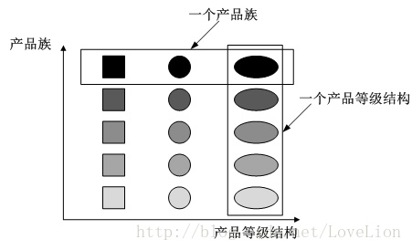
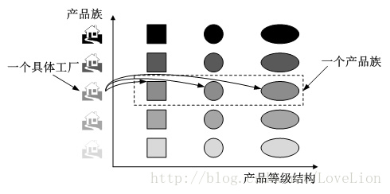

# 抽象工厂模式(abstract-factory)

## 1、产品族和产品等级
转自：[抽象工厂模式（二）：产品等级结构与产品族](https://blog.csdn.net/mark_lq/article/details/45132113)

>- 产品等级结构：产品等级结构即产品的继承结构
> - 产品族：在抽象工厂模式中，产品族是指由同一个工厂生产的，位于不同产品等级结构中的一组产品

### 1.1、例1
<table style="font-size:14px">
    <tr>
        <td>海尔冰箱</td>
        <td>海尔风扇</td>
        <td>海尔空调</td>
        <td>海尔热水器</td>
    </tr>
    <tr>
        <td>美的冰箱</td>
        <td>美的风扇</td>
        <td>美的空调</td>
        <td>美的热水器</td>
    </tr>
    <tr>
        <td>格力冰箱</td>
        <td>格力风扇</td>
        <td>格力空调</td>
        <td>格力热水器</td>
    </tr>
</table>

> 海尔的产品族：海尔冰箱、海尔风扇、海尔空调、海尔热水器 
> 风扇产品等级结构：海尔冰箱、美的冰箱、格力冰箱

### 1.2、例2
- 制作面包的过程
    - 1、制作面团（面粉品种、水）
    - 2、添加辅料（白糖、奶油之类的）
    - 3、成型（毛毛虫面包、五角星、大枕头）
    - 4、添加装饰品（葡萄干、肉松、芝麻）
    - 5、烤箱烤（温度和时长）
> - 产品族：面团、辅料、形状、装饰品、烤箱设置  
> - 产品等级结构：见上