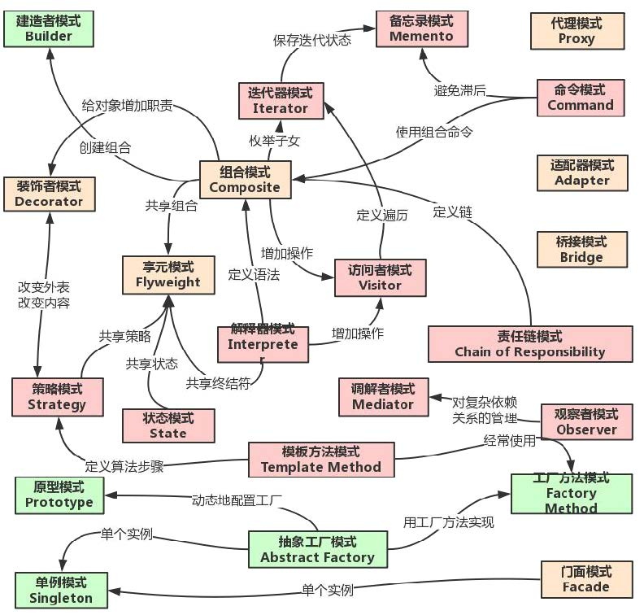

[toc]

# 设计模式总结1
> 推荐书籍：《图解设计模式》、《设计模式-可复用面向对象软件的基础》

## GOF23种设计模式的归纳和总结

<b>

分类|设计模式
:-|:-
创建型|工厂方面模式`Factory-Method`、抽象工厂模式`Abstract-Factory`、建造者模式`Builder`、原型模式`Prototype`、单例模式`Singletion`
结构型|适配器模式`Adapter`、桥接模式`Bridge`、组合模式`Composite`、装饰器模式`Decorator`、门面模式`Facade`、享元模式`Flyweight`、代理模式`Proxy`
行为型|解释器模式`Interpreter`、模板方法模式`Template Method`、责任链模式`Chain of Responsibility`、命令模式`Command`、迭代器模式`Iterator`、调解者模式`Mediator`、备忘录模式`Memento`、观察者模式`Observer`、状态模式`State`、策略模式`Strategy` 访问者模式`Visitor`

</b>

## 一句话总结

设计模式|总结|举例
:-|:-|:-
工厂模式`Factory`|封装创建过程，完成new的动作|BeanFactory、Calender
单例模式`Singletion`|保证某种场景下唯一 （全局唯一、线程里唯一、某个业务下唯一）|ApplicationContext
原型模式`Prototype`|批量生产|PrototypeBean
代理模式`Proxy`|代为处理，增强职能|ProxyFactoryBean、JdkDynamicAopProxy、CglibAopProxy
委派模式`Delegate`|干活算你的（普通员工），劳算我的（项目经理）|DispatcherServlet、BeanDefinitionParserDelegate
策略模式`Strategy`|弱水三千，只取一瓢|InstantiationStrategy
模板模式`Template`|流程标准化，步骤多样化|JdbcTemplate、HttpServlet
适配器模式`Adapter`|兼容转接头|AdvisorAdapter、HandlerAdapter
装饰器模式`Decorator`|包装，同宗同源|BufferedReader、InputStream OutputStream、HttpHeadResponseDecorator
观察者模式`Observer`|通知一些人做事情|ContextLoaderListener

           
学自<b>[咕泡学院](https://www.gupaoedu.com/)</b>
